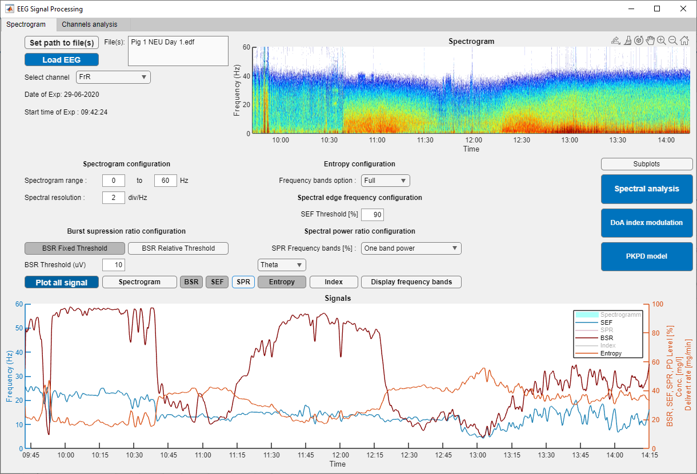
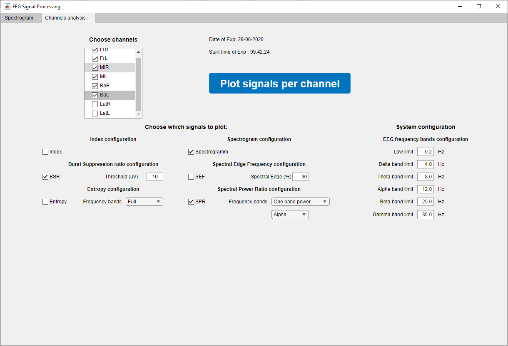
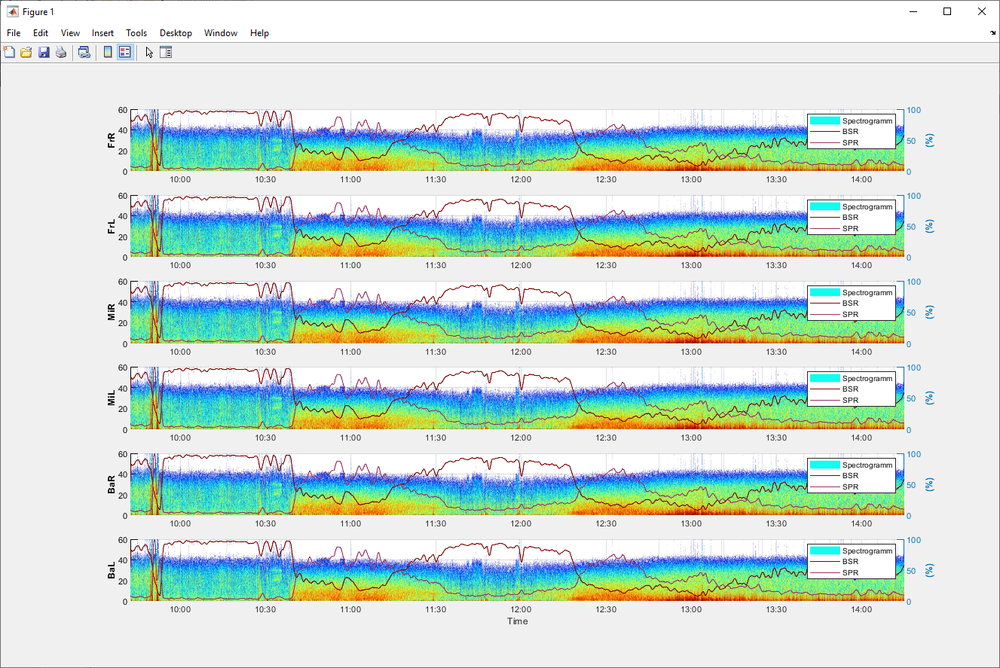

# General Anaesthesia Matlab-based Graphical User Interface
## GAM-GUI
General Anaesthesia Matlab-based Graphical User Interface (GAM-GUI) tool was created during the DoAi-Vet project funded by HES-SO and the Engineering and Architecture domain.
Here we have place for you the demo version of GAM-GUI with only two tabs for offline analysis of the tool to test its capabilities. 
If you are interested to test the full version including real-time analysis, please do not hasitate to contact us. A detailed desription of the tool can be found in our technical report https://www.researchgate.net/publication/371332093. 

### Single channel analysis
The first tab of GAM-GUI is designed to facilitate the analysis of EEG files in the .edf format. With this feature, users can conveniently load their desired EEG file and focus on processing the signals of a single channel. The tab offers multiple signal processing algorithms for exploring the depth of anesthesia. Moreover, users have the freedom to configure these algorithms according to their preferences, allowing for a personalized analysis experience. As the algorithms are applied, the graphs displaying the processed signals dynamically update.

<div style="text-align:center">
    
</div>

### Multiple channels analysis
In addition to the functionalities of the first tab, the second tab in our software enhances the analysis capabilities by enabling the simultaneous analysis of multiple channels. This means that users can now explore and process signals from multiple EEG channels, providing a comprehensive understanding of the data. With this feature, users can observe and compare the signals across different channels.

<div style="text-align:center">
    
</div>

The results of the multi-channels analysis will be displayed as shown below.

<div style="text-align:center">
    
</div>

## Getting Started

### Installation

To install our software, you can clone this repository into your computer using Git or download the files directly from GitLab.

```
git clone https://github.com/Simalatsar/GAM-GUI.git
```

In the "Installer files" folder, you will find an executable software that will guide you through the installation process using the MATLAB application installer.

### Usage

Once you launch the software, you have the option to use the "Set path to file(s)" feature, which enables you to choose the specific file(s) you wish to analyze. By clicking on the "Load EEG" button, the software will extract the EEG data and you will gain access to various signal processing options. You can use the "Plot all signal" button to visualize the results effectively.

To facilitate your testing process, we have included a collection of EEG file examples within the designated "EEG files examples" folder. You will find six distinct experiments that were conducted using two different measuring devices: BIOPAC and Sedline.

## Contact Us

If you have any questions, please feel free to contact us.

    PhD Prof. Alena Simalatsar (Head of Project) - https://www.linkedin.com/in/alena-simalatsar-2279a14/
    Engineer Benjamin Caillet - https://www.linkedin.com/in/cailletbenjamin/

